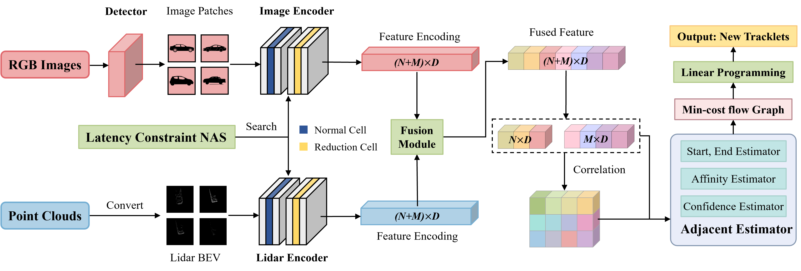

# PNAS-MOT: Multi-Modal Object Tracking with Pareto Neural Architecture Search

[](https://opensource.org/licenses/MIT)



## Introduction

Multiple object tracking is a critical task in autonomous driving. Existing works primarily focus on the heuristic design of neural networks to obtain high accuracy. As tracking accuracy improves, however, neural networks become increasingly complex, posing challenges for their practical application in real driving scenarios due to the high level of latency. In this paper, we explore the use of the neural architecture search (NAS) methods to search for efficient architectures for tracking, aiming for low real-time latency while maintaining relatively high accuracy. Another challenge for object tracking is the unreliability of a single sensor, therefore, we propose a multi-modal framework to improve the robustness.  Experiments demonstrate that our algorithm can run on edge devices within lower latency constraints, thus greatly reducing the computational requirements for multi-modal object tracking while keeping lower latency.

For more details, please refer our [paper](https://ieeexplore.ieee.org/abstract/document/10476688), [arxiv](https://arxiv.org/abs/2403.15712).

## Install

We recommand you to build a new conda environment to run the projects as follows:
```bash
conda create -n pnas-mot python=3.7 cython
conda activate pnas-mot
conda install pytorch torchvision -c pytorch
conda install numba
```

Then install packages from pip:
```bash
pip install -r requirements.txt
```


## Data

We provide the data split used in our paper in the `data` directory. You need to download and unzip the data from the [KITTI Tracking Benchmark](http://www.cvlibs.net/datasets/kitti/eval_tracking.php). You may follow [Second](https://github.com/traveller59/second.pytorch) for dataset preparation. Do remember to change the path in the configs.

The RRC detection results for training are obtained from [MOTBeyondPixels](https://github.com/JunaidCS032/MOTBeyondPixels). We use [PermaTrack](https://github.com/TRI-ML/permatrack) detection results provided by [OC-SORT](https://github.com/noahcao/OC_SORT/blob/master/docs/GET_STARTED.md) for the [KITTI Tracking Benchmark](http://www.cvlibs.net/datasets/kitti/eval_tracking.php). The detections are provided in *data/detections* already.


## Usage
To search for the architecture, you can run command

```bash
python train_search.py --config experiments/config_search.yaml
```

After finding the desired network structures, you can run the following command to train the model

```bash
python train.py --config experiments/config.yaml
```

The pretrained weights are stored in `experiments/`


We also provide our tracking results on the testing split in [Google Drive](https://drive.google.com/file/d/1rVx9gadYVacRryalJbvqQppaBppDtiVo/view?usp=drive_link).

## Visualization


## Citation

If you use this codebase or model in your research, please cite:
```
@article{peng2024pnas,
  title={PNAS-MOT: Multi-Modal Object Tracking with Pareto Neural Architecture Search},
  author={Peng, Chensheng and Zeng, Zhaoyu and Gao, Jinling and Zhou, Jundong and Tomizuka, Masayoshi and Wang, Xinbing and Zhou, Chenghu and Ye, Nanyang},
  journal={IEEE Robotics and Automation Letters},
  year={2024},
  volume={9},
  number={5},
  pages={4377-4384},
  doi={10.1109/LRA.2024.3379865},
  publisher={IEEE}
}
```

## Acknowledgement

This code benefits a lot from [SECOND](https://github.com/traveller59/second.pytorch) and use the detection results provided by [MOTBeyondPixels](https://github.com/JunaidCS032/MOTBeyondPixels). The GHM loss implementation is from [GHM_Detection](https://github.com/libuyu/GHM_Detection).
